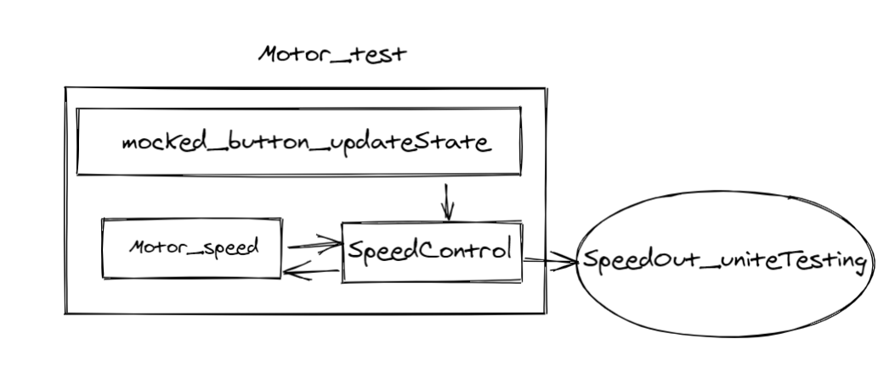
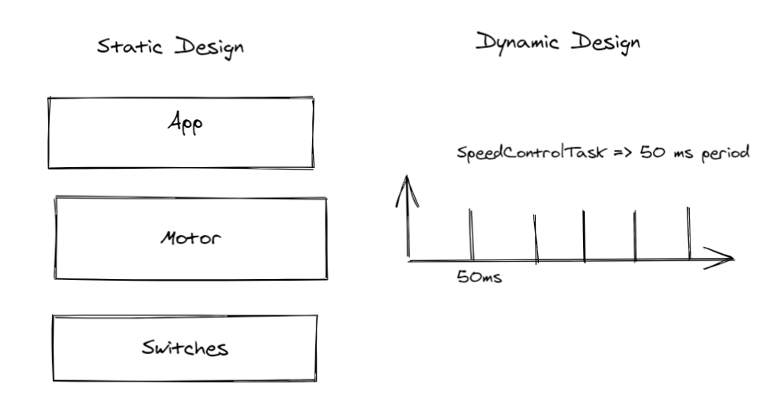
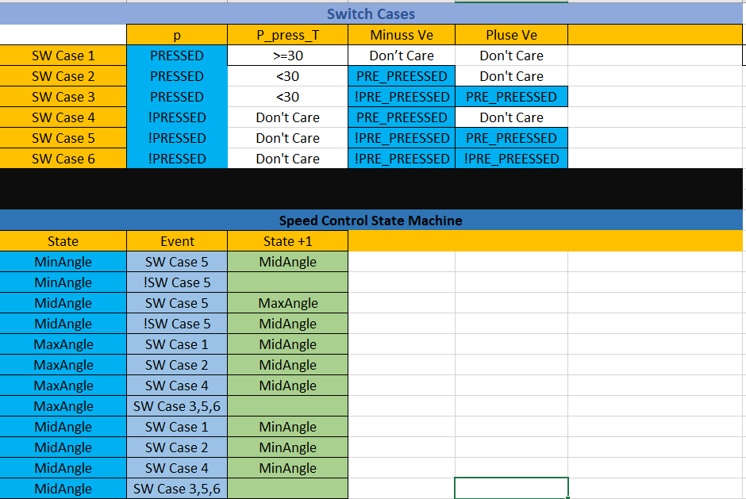
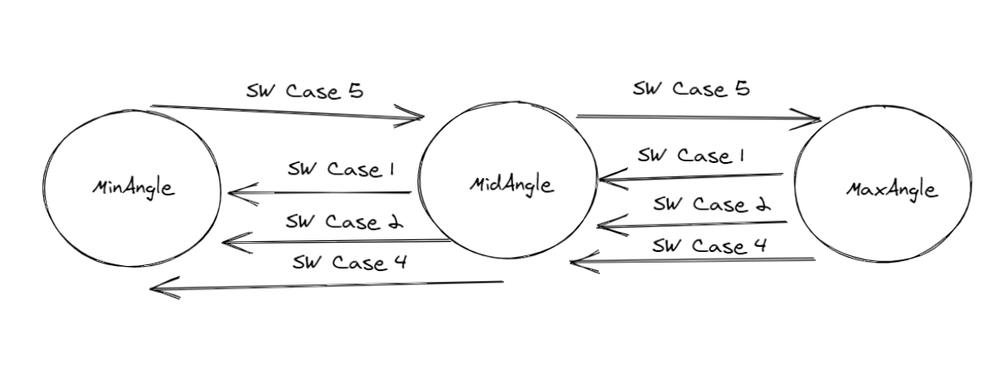
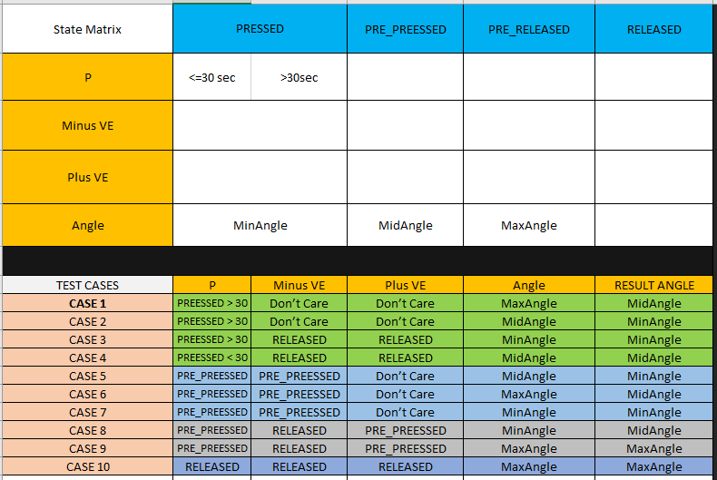
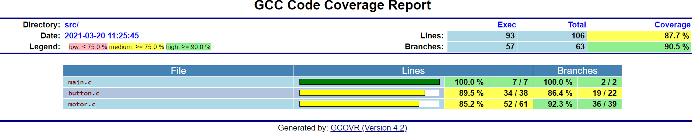

# Motor Speed Control Using TDD
##### Mahmoud Abdelbary
* this project is implementaion of the Swift Act requirment of Speed Control Module 

###### Requirments can be found under documentation/Requirments.pdf

### Dependencies:
1. Ceedling FramWork [link](http://www.throwtheswitch.org/ceedling).

### instruction
##### Kindly follow the following instruction to run the system
*   after installing ceedling , open terminal in the project home
*   ceedling test:all will run all 32 test for all modules [button,motor,main]
*   ceedling test:[modulename] will run the test cases for that specific module for example: ceedling test:motor
*   ceedling test:motor and ceedling test:all will run the unite test for motor which will mock the input process with the data provided in the last image 
    and append the output to file src/SpeedOut_uniteTesting.txt  _10 test cases_
*   ceedling release will run the relase version, The excutable will be in build/release/SpeedControl.exe 
    running the excutable will take input from input file and append the output to src/SpeedOut_release.txt file

##### Testing Release
*   to test release first place test case record in src/SwitchStateInput.txt with 4 spaces between each entry
*   build/release/SpeedControl.exe
*   open src/SpeedOut_release.txt this should match the expected value for each test case.

##### Kindly note that input file has only two test cases just to make sure it is up and running a wider range of tests has been done using unite test over motorSpeedControl task
##### project documented useing doxygen documentaion 
### Design:
The project emulate Motor Speed Control system using OS in and output files.

#### Release SystemView:

#### uniteTesting SystemView:

#### Static/Dynamic Design:

#### Switch Important States

##### The states are represented in the motor_test.c file and used in testing

#### Speed Control State Machine

#### 1-Switch Coverage Diagram

* I chossed to skip the leafe branches of the left side tree as it's already tested as part of the right side
* The test function to test switch coverage are 6 functions one for each branch, The naming convention is:
    * test_SpeedControlTask_switchCoverage_Tree<BranchNumber>Branch_<Sequence>(void)
#### uniteTesting Cases for SpeedControl Task:
* This to test the transition between states one transation per test Testing both valid and invalid transitions.

#### Coverage Statistics:
* using gcov tool, The full documented statistics can be found under Documentation/CodeCoverageStatistics.

#### EP testing has been done for the following funtions:
* ERR_t motor_setAngle(motor_angles_t angle)
    * Ranges{ INT_MIN-->MinAngle[10] , MinAngle[10]-->MaxAngle[140] , MaxAngle[140]-->INT_MAX }

    * Tested values 
        * Valid {10,90,140}
        * unValid {INT16_MIN,-1,9,141,100,INT16_MAX}

* Buttons_state_t button_getState(Buttons_t btn);
    * Ranges{ INT_MIN-->BTN1 , BTN2 , BTN3 , BTN3-->INT_MAX } 

    * Tested Values
        * Valid { BTN1 , BTN2 , BTN3 }
        * unValid { INT16_MIN , -1 , NUM_OF_BTNS , INT16_MAX }
